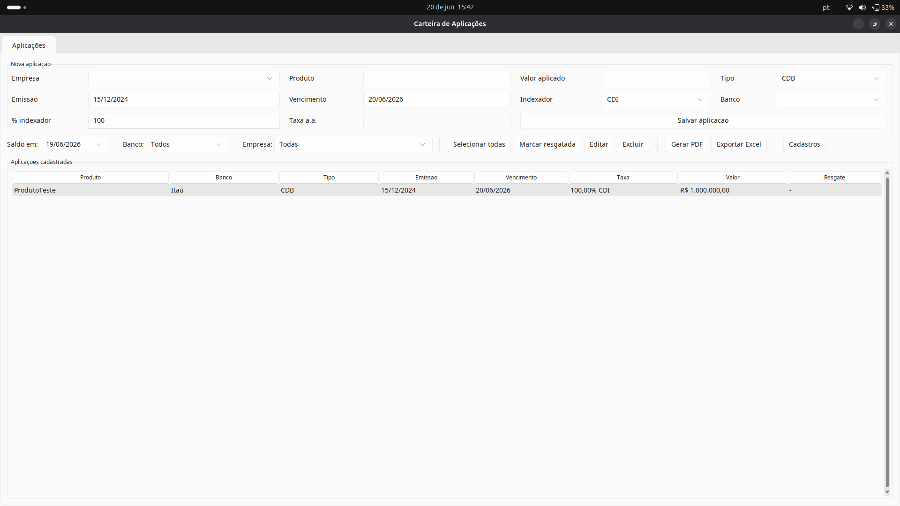
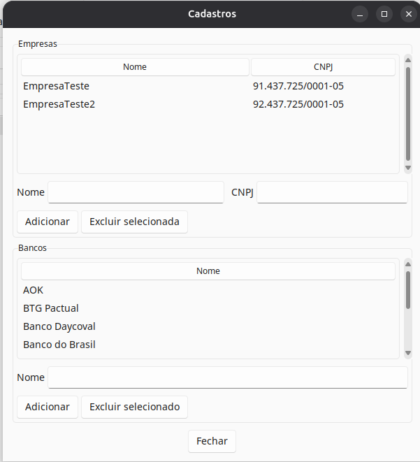
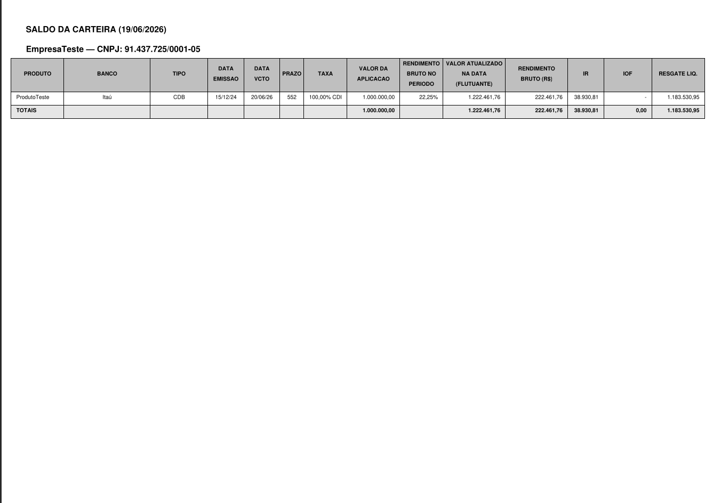
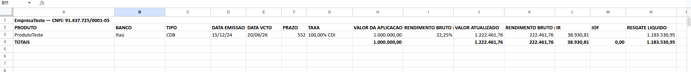

# Carteira de Rendimento

Aplicativo desktop desenvolvido para gestão e acompanhamento de aplicações de renda fixa. O sistema permite cadastrar aplicações financeiras, calcular rendimento diário com base nas taxas históricas do Banco Central, apurar impostos automaticamente e gerar relatórios em PDF e Excel.

> Projeto desenvolvido para substituir controles manuais em planilhas, centralizando o acompanhamento da carteira em uma aplicação desktop com banco de dados PostgreSQL.

---

## Demonstração

### Tela principal

A tela principal concentra o cadastro de aplicações, filtros por banco e empresa, seleção de data-base para consulta de saldo, listagem da carteira e ações de relatório.



### Cadastro e filtros

O sistema permite cadastrar aplicações informando empresa, produto, valor aplicado, tipo de produto, banco emissor, datas de emissão e vencimento, indexador e taxa configurada.



### Relatórios

A aplicação gera demonstrativos em PDF e exportações em Excel com informações consolidadas da carteira, incluindo rendimento bruto, valor atualizado, impostos e valor líquido de resgate.





---

## Funcionalidades

### Cadastro de aplicações

Cada aplicação registra:

* Nome do produto
* Tipo da aplicação
* Banco emissor
* Empresa vinculada
* Valor aplicado
* Datas de emissão e vencimento
* Indexador
* Percentual, taxa fixa ou spread

Tipos de produto suportados:

* CDB
* Compromissada
* LC
* Mútuo

Indexadores disponíveis:

| Indexador | Configuração                      |
| --------- | --------------------------------- |
| CDI       | Percentual do CDI                 |
| SELIC     | Percentual da SELIC               |
| SELIC+    | Spread fixo somado à SELIC diária |
| Prefixado | Taxa anual fixa                   |

---

## Cálculo de rendimento

O sistema calcula o rendimento diário acumulado com base nas taxas históricas disponibilizadas pela API SGS do Banco Central.

Também realiza:

* Projeção para datas futuras usando a última taxa disponível
* Apuração automática de IOF
* Apuração automática de IR conforme tabela regressiva
* Tratamento específico para operações compromissadas isentas de IOF
* Cálculo de valor atualizado e valor líquido de resgate

---

## Relatórios

O sistema permite gerar:

* **PDF:** demonstrativo completo da carteira, com totais consolidados por empresa
* **Excel:** planilha detalhada com produto, tipo, banco, datas, taxa, rendimento bruto, valor atualizado, IR, IOF e valor líquido

Os filtros de banco, empresa e data-base são aplicados tanto na listagem quanto nos relatórios.

---

## Gestão de resgates

A aplicação permite marcar uma aplicação como resgatada, informando a data do resgate.

Aplicações resgatadas permanecem no histórico e podem ser consideradas ou ignoradas nos relatórios conforme a data-base selecionada.

---

## Cadastros auxiliares

O sistema possui uma tela de cadastros para gerenciar:

* Empresas
* Bancos emissores

Esses cadastros são utilizados nos filtros, relatórios e vínculos das aplicações.

---

## Arquitetura

O projeto segue o padrão MVC com injeção de dependências.

O arquivo `main.py` atua como raiz de composição da aplicação, criando a conexão com o banco, instanciando repositórios, serviços e controller, e injetando as dependências na interface.

```text
main.py  →  CarteiraController  →  Repositórios  →  PostgreSQL
                    ↓
             Serviços de cálculo, taxas, PDF e Excel
                    ↓
              Interface Tkinter
```

Estrutura simplificada:

```text
app/
  models/
  controllers/
  repositories/
  services/
  utils/
  views/
  manager.py
  logger.py
config.py
main.py
schema.sql
```

---

## Banco de dados

Principais tabelas utilizadas:

```sql
d_empresa
d_banco
f_aplicacao
f_taxa
```

---

## Como executar

### Pré-requisitos

* Python 3.10+
* PostgreSQL local ou remoto

### Instalação

```bash
pip install -r requirements.txt
```

### Configuração

Crie o arquivo `config.toml` com os dados de conexão:

```toml
[conexoes]
servidor = "seu-servidor"
banco = "nome_do_banco"
```

Crie também o arquivo `.env`:

```env
CARTEIRA_AUTH=<usuario:senha em base64>
```

### Criar as tabelas

Execute o script `schema.sql` no banco PostgreSQL.

```bash
psql -h <servidor> -U <usuario> -d <banco> -f schema.sql
```

### Rodar o projeto

```bash
python main.py
```

---

## Gerar executável

```bash
python -m PyInstaller --onefile --windowed --name "Carteira de Rendimento" main.py
```

O executável será gerado na pasta `dist/`.

---

## Observações

Este projeto foi desenvolvido com foco em uma necessidade real de negócio: automatizar o acompanhamento de aplicações financeiras, reduzir controles manuais e gerar relatórios padronizados para análise da carteira.
